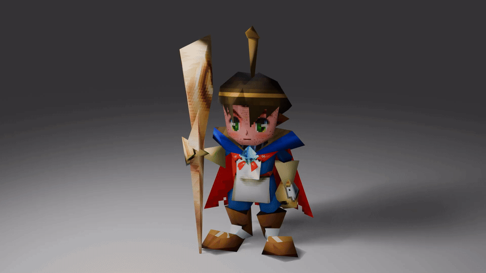

# Quest 64 Tale: Recompiled Mods

Download the [v1.0.7 mod packs ZIP](https://github.com/boricuapab/quest64tale-recompiled-mods/releases/tag/v1.0.7).

Companion packs for [Quest 64 Tale: Recompiled](https://github.com/boricuapab/quest64tale-recompiled), version **1.0.7**.

Open Mods → Open Mods Folder in the game launcher, copy the `.qsmod` files and `brian-hires.rtz` into that folder, then enable the packs. Installable files in this repository are in `mods/dist`. Packs are shared by Windows and Linux; install them in each platform's own profile.

- **Maximum Stats**: HP/MP maxima 500, agility/defense 255 and all elemental levels 50. Fills HP/MP once when enabled; does not provide infinite health.
- **All Spells**: elemental levels 50 independently of physical stat boosts.
- **Quest 64 Debug Menu**: after loading a game, open Settings → Debug. Choose a region/submap/entrance or a boss, then press its arrow. Finish active battles first. Boss encounters use native progression; travel does not complete earlier quests automatically.
- **Brian High Resolution Textures**: the three supplied 2048×2048 face replacements, with original cutout masks retained. No ROM, GLB models or unchanged original character textures are included.

Disabling the stat packs restores values captured in the current session. Saving with boosts active records boosted values; boss victories update saves normally.

The `.qsmod` files contain feature manifests for handlers compiled into the game. The RT64 texture pack and its three replacement PNGs are included here by the maintainer's request. `tools/package.py` rebuilds packs from their editable folders.

Code is GPL-3.0. Supplied texture artwork is maintained separately from the game's source repository; no additional licensing grant is asserted here.

## New gameplay packs

These three packs require game v1.0.7 or later and are disabled by default.

- **Auto Save**: checkpoints after door/zone movement finishes. Keeps two generations in the profile's `autosaves` folder, separate from Controller Pak saves. Use **Restore Auto Save** in the Mods footer, load a game if needed, and close settings. Older checkpoints use native entrance placement. Battles and dead-player states are protected.
- **Random Encounter Rate**: use **Configure** to select **Off**, **10%**, **25%**, **50%**, or **Default**. Rates apply per distance travelled; scripted bosses remain available.
- **Enemy Health Bars**: overhead bars update every battle frame, including bosses. Close-range bars stay at the screen edge. Green/yellow/red indicate remaining health.

The release ZIP contains exactly the seven installable `.qsmod`/`.rtz` files at its root. Editable sources remain under `packs`; `tools/package.py` rebuilds them into `mods/dist`.

Linux's usual mod directory is `~/.config/Quest64Recompiled/mods`. Windows uses `%LOCALAPPDATA%/Quest64Recompiled/mods`. Portable mode can change the profile location.
